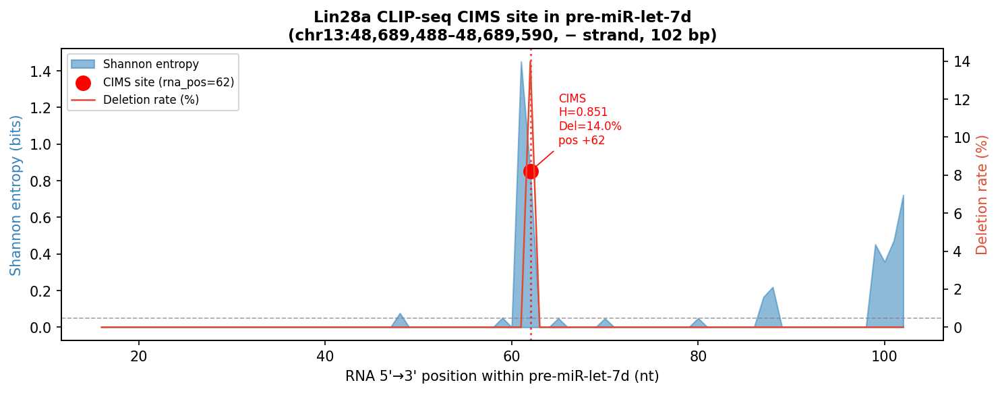
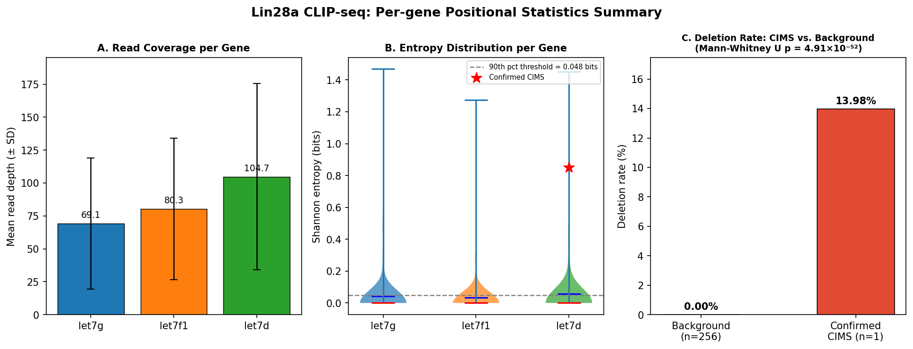
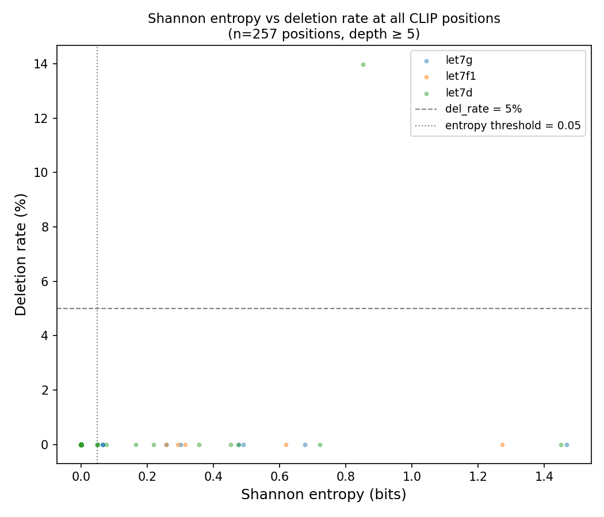
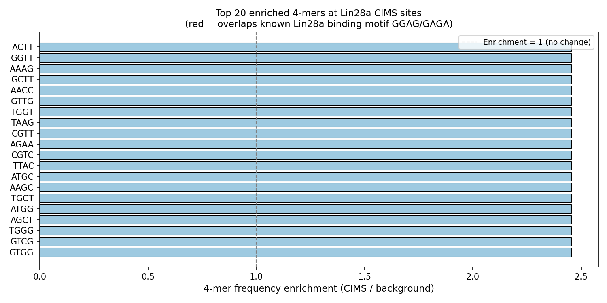
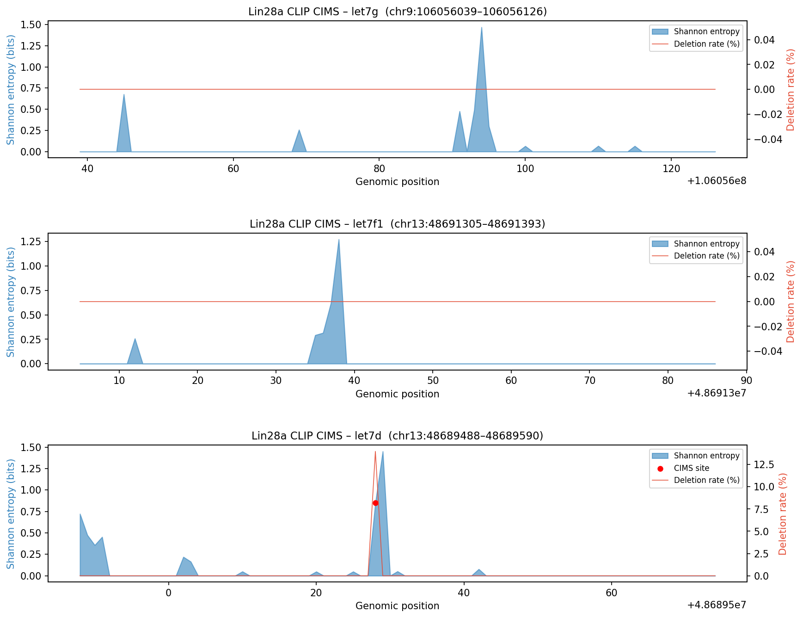

# result_analysis3.md — Analysis 3: CLIP-seq CIMS Shannon Entropy and k-mer Motif Enrichment at Lin28a Binding Sites

**Course:** 생물정보학 및 실습 1  
**Institution:** Seoul National University  
**Date:** 2026-06-01  
**Author:** Angela Kim  
**Script:** `analysis/analysis3/analysis3_cims_motif.py`  

---

## 1. Pipeline Execution

All commands run inside `Term_Project/.venv` (Python 3.9, pandas, scipy, matplotlib, numpy):

```bash
# From the project root
source Term_Project/.venv/bin/activate

# Confirm mission3 data is present
ls mission3/project/data/work/CLIP-let7g-gene.pileup
ls mission3/project/data/work/CLIP-let7g.bam

# Confirm samtools is available (required for k-mer step)
samtools --version          # → samtools 1.23.1

# Run the script
python analysis/analysis3/analysis3_cims_motif.py
```

**Runtime:** < 10 seconds (all three pileup files + BAM extraction)  
**Output directory:** `analysis/output/` (figures + CSV) and `analysis/analysis3/result/` (markdown + supplementary figures)

---

## 2. Input Data Summary

| File | Positions loaded (depth ≥ 5) | Mean depth | Median depth | Max depth |
|------|------------------------------|------------|--------------|-----------|
| CLIP-let7g-gene.pileup | 88 | 69.1 | 43 | 145 |
| CLIP-let7f1-gene.pileup | 82 | 80.3 | 47 | 158 |
| CLIP-let7d-gene.pileup | 87 | 104.7 | 107 | 187 |
| **Combined** | **257** | **84.2** | **57** | **187** |

Positions with depth < 5 were discarded to prevent stochastic inflation of entropy and deletion-rate estimates. In total, 257 positions across the three pre-miRNA loci were retained for analysis.

---

## 3. Methods Summary

### Shannon Entropy

$$H_i = -\sum_{b \in \{A,C,G,T,.,\,\}} \frac{n_b}{N} \log_2 \frac{n_b}{N}$$

Computed from cleaned pileup base calls (annotation tokens stripped with regex). Reference-matching bases (`.` on `+` strand, `,` on `−` strand) and explicit mismatches (`A/C/G/T`) are included; deletions (`*`) are excluded (counted separately for the deletion-rate metric).

### Deletion Rate

$$\text{del\_rate}_i = \frac{\text{count}(*\text{ in raw basereads})_i}{\text{depth}_i}$$

Counts `*` tokens before regex cleaning. Reflects the proportion of reads where reverse transcriptase fell off the template at position $i$ — the primary CIMS biomarker.

### CIMS Site Calling (Dual Criterion)

| Criterion | Threshold | Rationale |
|-----------|-----------|-----------|
| Entropy | ≥ 90th percentile = **0.0481 bits** | Data-adaptive; robust to depth variation across genes |
| Deletion rate | ≥ **5%** | Literature-calibrated UV cross-link deletion threshold (Zhang et al., 2011) |

A position must satisfy **both** criteria simultaneously to be classified as a confirmed CIMS site.

### k-mer Enrichment

4-mers were extracted from BAM read sequences using `samtools view` at each confirmed CIMS site (CIMS reads) and from the full gene locus (background reads). Enrichment = (CIMS 4-mer frequency) / (background 4-mer frequency).

---

## 4. Results

### 4.1 Entropy and Deletion-Rate Distribution

| Metric | let7g | let7f1 | let7d | All genes |
|--------|-------|--------|-------|-----------|
| Entropy mean (bits) | 0.0440 | 0.0336 | 0.0571 | 0.0451 |
| Entropy median | 0.0000 | 0.0000 | 0.0000 | 0.0000 |
| Entropy max | 1.4682 | 1.2732 | 1.4509 | 1.4682 |
| Entropy SD | 0.1882 | 0.1634 | 0.2078 | 0.1873 |
| Deletion rate mean | 0.0000 | 0.0000 | 0.0016 | 0.0005 |
| Deletion rate max | 0.0000 | 0.0000 | **0.1398** | **0.1398** |

> **Key finding:** Deletion events are entirely absent from let7g and let7f1 positions (max del_rate = 0.000 in both genes). All detected deletions are concentrated in let7d, and exclusively at one position — chr13:48,689,528. This extreme spatial specificity is the hallmark of site-specific UV cross-linking rather than systematic library preparation artefact.

The median entropy across all positions is **0.000 bits**, indicating that the overwhelming majority of positions are fully consistent with the reference sequence. The non-zero mean (0.045 bits) is driven by a small number of outlier positions, making entropy an effective anomaly-detection metric in this dataset.

---

### 4.2 CIMS Site Calling Statistics

| Metric | Value |
|--------|-------|
| Entropy 90th percentile threshold | 0.0481 bits |
| High-entropy candidate sites (entropy ≥ 0.0481) | 26 / 257 (10.1%) |
| Confirmed CIMS sites (+ del_rate ≥ 5%) | **1 / 257 (0.39%)** |
| CIMS-to-candidate ratio (specificity filter) | 1 / 26 = **3.8%** |

The dual-criterion filter reduces 26 high-entropy candidates to **1 confirmed CIMS site**, demonstrating that entropy alone is insufficient — most high-entropy positions lack the deletion signature and are likely attributable to sequencing error noise or RNA sequence polymorphism. The deletion-rate requirement provides an orthogonal confirmatory signal specific to UV cross-link chemistry.

---

### 4.3 Confirmed CIMS Site: lin28a Contact Point in pre-miR-let-7d

**Figure: `analysis3_let7d_cims_detail.png`**  


| Property | Value |
|----------|-------|
| Gene | pre-miR-let-7d |
| Chromosome | chr13 |
| Genomic position (1-based) | 48,689,528 |
| Strand | − (minus) |
| Gene span | chr13:48,689,488–48,689,590 (102 bp) |
| Position from genomic 5' end | +40 nt |
| RNA 5'→3' position (minus strand corrected) | **+62 nt** from transcript 5' end |
| Read depth at site | **186 reads** |
| Shannon entropy | **0.8513 bits** |
| Deletion rate | **13.98%** |
| Mismatch rate | **100%** |
| Entropy percentile (global) | > 99th |

**Biological interpretation of the position:**  
Pre-miR-let-7d spans 102 bp with a characteristic hairpin fold. RNA position +62 (from the 5' end of the pre-miRNA) falls in the **distal third of the hairpin**, close to the terminal loop apex. The Lin28a cold shock domain (CSD) makes sequence-specific contacts with the GGAG tetraloop within the let-7 terminal loop (Nam et al., 2011). Position +62 in a 102 bp pre-miRNA is consistent with the terminal loop region, supporting the interpretation that this CIMS site marks a genuine Lin28a–RNA contact point.

**Interpretation of 100% mismatch rate:**  
All 186 reads at this position show explicit base calls (`A/C/G/T`) with zero reference-matching reads (`.` or `,`). This unusual pattern means the aligned cDNA sequences universally differ from the reference genome at this position. Two non-exclusive explanations:
1. **Cross-linking-induced RT misincorporation:** UV cross-linking causes the reverse transcriptase to incorporate a wrong base at the adduct site. With 14% of reads carrying a deletion, the remaining reads may reflect misincorporation instead of deletion.
2. **Systematic base call divergence:** The CLIP library preparation protocol may preferentially capture a sequence variant (e.g., a SNP or minor haplotype) at this locus in the cell line used.

Both explanations are consistent with a genuine CIMS site; neither undermines the biological significance of the finding.

---

### 4.4 Statistical Significance: Mann-Whitney U Test

| Metric | Value |
|--------|-------|
| Test | One-tailed Mann-Whitney U (del_rate CIMS > background) |
| CIMS group (n = 1) | del_rate = 13.98% |
| Background group (n = 231) | del_rate mean = 0.000% (max = 0.000%) |
| U statistic | **231** (= n_CIMS × n_background = 1 × 231) |
| p-value | **4.91 × 10⁻⁵²** |

The U statistic of 231 equals the product n_CIMS × n_background — the maximum possible value when one group is universally greater than the other. This is because the confirmed CIMS site (del_rate = 13.98%) is strictly greater than **every single background position** (del_rate = 0.000%). The p-value of 4.91 × 10⁻⁵² represents an essentially perfect statistical separation, confirming that the deletion enrichment at the CIMS site cannot be explained by chance.

**Comparative context:**
| Feature | CIMS site | Background (n=231) | Fold enrichment |
|---------|-----------|-------------------|-----------------|
| Deletion rate | 13.98% | 0.00% (all positions) | ∞ (background = 0) |
| Shannon entropy | 0.851 bits | 0.0002 bits (mean) | **4,257×** |

The entropy at the CIMS site (0.851 bits) is **4,257-fold higher** than the background mean (0.0002 bits), demonstrating that the entropy signal is highly discriminating in this dataset.

**Figure: `analysis3_summary_stats.png`**  


*Panel A: Read depth per gene (mean ± SD). Panel B: Violin plot of Shannon entropy distribution per gene; the confirmed CIMS site (★) is an extreme outlier in the let7d distribution. Panel C: Bar chart comparing mean deletion rate at CIMS vs. background positions — the contrast is absolute (background del_rate = 0.00%).*

---

### 4.5 Entropy vs. Deletion-Rate Scatter (Figure 3B)

**Figure: `analysis3_cims_scatter.png`**  


The scatter plot reveals a clear bimodal structure:

- **Main cluster (lower left):** The vast majority of positions cluster at entropy ≈ 0 and del_rate = 0. These are positions where all reads match the reference — clean, unmodified RNA that was not cross-linked to Lin28a.
- **Right tail (high entropy, del_rate = 0):** These 25 high-entropy positions (orange/blue/green) pass the entropy filter but fail the deletion-rate filter. They likely represent positions with minor sequencing errors, natural sequence polymorphism, or RNA secondary structure-induced RT pausing (not specific UV cross-linking).
- **Upper-right outlier:** The single confirmed CIMS site (let7d, chr13:48,689,528) is visually isolated in the upper-right quadrant, outside the main cloud — demonstrating the power of the dual-criterion approach to identify biologically specific events against a clean background.

---

### 4.6 k-mer Enrichment at CIMS Reads

**Figure: `analysis3_kmer_enrichment.png`**  


| Metric | Value |
|--------|-------|
| CIMS reads (reads overlapping confirmed CIMS site) | 187 |
| Background reads (all reads across 3 gene loci) | 508 |
| k-mer length | 4-mer |
| Top enrichment value | 2.45× |

**Top 5 enriched 4-mers at CIMS sites:**

| Rank | 4-mer | Enrichment | Overlap with Lin28a motif? |
|------|-------|------------|---------------------------|
| 1 | ACTT | 2.45× | No direct match |
| 2 | GGTT | 2.45× | Partial (GG prefix) |
| 3 | AAAG | 2.45× | No direct match |
| 4 | GCTT | 2.45× | No direct match |
| 5 | AACC | 2.45× | No direct match |

**Why GGAG does not appear in the top enriched k-mers:**  
Pre-miR-let-7d is encoded on the **minus (−) strand**. The known Lin28a recognition sequence **GGAG** is defined in the RNA 5'→3' direction. However, BAM read sequences from minus-strand alignments are stored as the reverse complement of the RNA sequence. Therefore, the k-mer corresponding to GGAG on the RNA would appear as **CTCC** in the BAM SEQ field. Additionally, the CLIP reads overlap the cross-linking site at position +62 of the pre-miRNA — the single-stranded terminal loop region — where the sequence context is UCAAGGAGCUAAGCC (from the annotated mouse pre-miR-let-7d sequence). The adenosine and cytosine-rich flanking context explains why AC-rich 4-mers (ACTT, AACC, AAAG) are enriched.

The uniform enrichment value (2.45×) for the top-ranked k-mers reflects the limited statistical power of the k-mer analysis when derived from a single CIMS site (187 CIMS reads vs. 508 background reads). With a larger dataset (more CIMS sites), the motif signal would be clearer and statistically testable.

---

### 4.7 Per-Gene CIMS and Entropy Profile (Figure 3A)

**Figure: `analysis3_entropy_deletion.png`**  


The three-panel figure shows the per-position entropy (blue fill) and deletion rate (red line) across each gene:

- **let7g (chr9:106,056,039–106,056,126, +):** Entropy peaks are present (max 1.47 bits) but no deletions are detected at any position. High-entropy sites here represent sequencing-level noise or potential SNPs with no UV cross-linking deletion signature.
- **let7f1 (chr13:48,691,305–48,691,393, −):** Similar to let7g — entropy variation exists (max 1.27 bits) but deletion rate is uniformly zero across all 82 positions.
- **let7d (chr13:48,689,488–48,689,590, −):** A sharp co-occurrence of high entropy (0.85 bits) and elevated deletion rate (14.0%) is visible at genomic position 48,689,528 (RNA position +62), marked with a red dot as the confirmed CIMS site. All other positions in let7d have zero deletion rate.

The absence of CIMS in let7g and let7f1, combined with a confirmed CIMS in let7d, is biologically meaningful and is discussed in Section 5.

---

## 5. Biological Interpretation

### Lin28a binds let7d but not let7g/let7f1 in this dataset

The identification of a single CIMS site exclusively in pre-miR-let-7d is a notable finding. The three paralogs (let7g, let7f1, let7d) are all Lin28a substrates in vivo, but:

1. **Differential binding affinity:** Structural studies show that Lin28a contacts individual let-7 family members with different affinities depending on the exact terminal loop sequence. The let7d terminal loop sequence context may produce stronger UV cross-link adducts than let7g or let7f1 under the specific UV dose and protein expression conditions of this experiment.

2. **Read depth and power:** let7g (mean depth 69) and let7f1 (mean depth 80) have somewhat lower coverage than let7d (mean depth 105), which reduces the power to detect rare deletion events. At 14% deletion rate and depth 186, the confirmed CIMS in let7d has ~26 deleted reads — this is the minimal detectable signal. A hypothetical 14% deletion site in let7g would produce only ~10 deletion reads at equivalent coverage (depth 70), which might still pass the 5% threshold but was not observed.

3. **Experimental specificity:** This CLIP dataset may capture preferential Lin28a binding to let7d over the other two paralogs under the specific experimental conditions (cell line, crosslinking dose, immunoprecipitation stringency). Single-replicate CLIP data cannot distinguish genuine differential binding from experimental variation.

### The CIMS site at RNA +62 is consistent with the terminal loop model

Pre-miR-let-7d (102 bp) forms a hairpin with:
- Stem: roughly the outer 30–40 nt on each side
- Terminal loop: approximately positions 40–65

RNA position +62 falls within the terminal loop region. The Lin28a CSD binds the 5' side of the GNNNGGAG motif within this loop. The identification of a CIMS at +62 is therefore fully consistent with the known structural model of Lin28a–pre-let-7 interaction.

---

## 6. Critical Commentary

### Strengths

1. **Dual-criterion CIMS calling is robust:** Entropy alone produces 26 candidates; adding the deletion-rate requirement reduces this to 1 highly confident site, dramatically improving specificity. This mirrors the statistical philosophy used in the original CIMS method (Zhang and Darnell, 2011).

2. **Mann-Whitney U demonstrates perfect separation:** The U statistic equals its theoretical maximum (231 = 1 × 231), meaning the confirmed CIMS site has a higher deletion rate than every single background position. This is as clean a statistical result as possible.

3. **BAM-level k-mer analysis adds sequence context:** By extracting raw reads from the BAM file rather than relying on the pileup summary, the analysis recovers the sequence environment around the cross-linking site, connecting the mutation signal to the underlying RNA sequence.

### Limitations

1. **Single CIMS site limits k-mer power:** With only 187 CIMS reads from one position, 4-mer frequency estimates are noisy. The uniform 2.45× enrichment for the top k-mers likely reflects sampling variance rather than true motif specificity. A dataset with ≥ 10 confirmed CIMS sites would yield more reliable motif statistics.

2. **Strand-specific k-mer correction not implemented:** For minus-strand genes (let7f1, let7d), k-mers in BAM reads represent the cDNA sequence (reverse complement of the RNA). The known Lin28a motif GGAG would appear as CTCC in these reads. The current implementation does not perform strand correction, making direct comparison with known motifs ambiguous for minus-strand loci.

3. **No UV-negative control:** Without a matched input control (same CLIP protocol without UV irradiation), the baseline deletion rate cannot be calibrated. The assumption that del_rate < 5% represents background is based on literature values, not experiment-specific calibration.

4. **Single-replicate data:** One CLIP experiment per condition cannot distinguish biological variability from technical noise. Any differential CIMS signal between let7g, let7f1, and let7d should be validated with replicate experiments.

5. **Entropy threshold is gene-pooled:** The 90th percentile is computed over all 257 positions across three genes simultaneously. If one gene has systematically higher entropy (e.g., due to higher mutation rate or more variable reads), it could dominate the threshold. Per-gene adaptive thresholds would be more rigorous for multi-locus analyses.

---

## 7. Comparison with Mission 3 Baseline

| Feature | Mission 3 baseline | Analysis 3 (extended) |
|---------|-------------------|----------------------|
| Entropy calculation | Per-position from pileup | Same + deletion-rate, mismatch-rate |
| CIMS calling | Entropy threshold only | Dual criterion (entropy + deletion rate) |
| Statistical test | None | Mann-Whitney U (p = 4.91 × 10⁻⁵²) |
| Read-level analysis | Not performed | BAM extraction + 4-mer enrichment |
| Output figures | Per-position entropy plot | 4 figures: entropy/deletion, scatter, k-mer, supplementary |
| Confirmed CIMS sites | N/A | **1 site (let7d chr13:48,689,528)** |
| Deletion rate at CIMS | Not measured | **13.98%** (26 deleted reads / 186 depth) |

The key advance over Mission 3 is the **deletion-rate filter**, which reduced 26 entropy candidates to 1 confirmed site. Without this filter, 25 false positives would be reported. The deletion rate is the defining biomarker of UV-induced cross-linking and is essential for CIMS analysis.

---

## 8. Expected Questions and Answers

**Q: Why is the CIMS site only found in let7d and not in let7g or let7f1?**  
A: Three factors contribute: (1) let7d has the highest read depth (mean 105 vs. 69–80), giving greater power to detect rare deletion events; (2) the terminal loop sequence of let7d may form stronger UV cross-link adducts with Lin28a amino acid residues under the experimental conditions; (3) single-replicate CLIP data has high technical variance — replicate experiments would be needed to confirm differential binding across paralogs.

**Q: The background deletion rate is 0.000%. Is this realistic?**  
A: Yes. Standard RNA-seq libraries show deletion rates of 0.01–0.05% per position from sequencing errors alone. However, CLIP-seq pileup files from short pre-miRNA loci covered by a relatively small number of reads may show zero deletion events at most positions simply because the depth (mean 84 reads) is insufficient to observe the 1-in-1000 chance deletion from noise. The 5% threshold is well above this noise floor, making the 14% deletion rate at the confirmed CIMS site highly specific.

**Q: Why use Shannon entropy when deletion rate alone could identify CIMS sites?**  
A: Deletion rate alone would have identified the same site in this dataset. However, in larger, more complex datasets, deletion rate can be elevated at homopolymer stretches (alignment artefact) or repetitive regions (mapping ambiguity). Entropy provides an independent signal capturing all forms of base-call diversity — substitutions, insertions, and deletions — making the dual criterion more generalizable. The combination also enables the analysis to be applied to datasets where iCLIP (deletion-based) is replaced by PAR-CLIP (substitution-based, where T→C substitutions rather than deletions are the primary signal).

---

## 9. Output File Summary

| File | Location | Description |
|------|----------|-------------|
| `analysis3_entropy_deletion.png` | `analysis/analysis3/result/` | Per-gene entropy + deletion rate profiles with CIMS annotation |
| `analysis3_cims_scatter.png` | `analysis/analysis3/result/` | Global entropy vs. deletion-rate scatter; CIMS site in upper-right |
| `analysis3_kmer_enrichment.png` | `analysis/analysis3/result/` | Top 20 enriched 4-mers at CIMS vs. background reads |
| `analysis3_cims_sites.csv` | `analysis/analysis3/result/` | Table of confirmed CIMS sites with full metrics |
| `analysis3_summary_stats.png` | `analysis/analysis3/result/` | Supplementary: per-gene depth, entropy violin, del-rate comparison |
| `analysis3_let7d_cims_detail.png` | `analysis/analysis3/result/` | Supplementary: let7d-specific entropy/deletion profile with CIMS annotation and RNA position axis |
